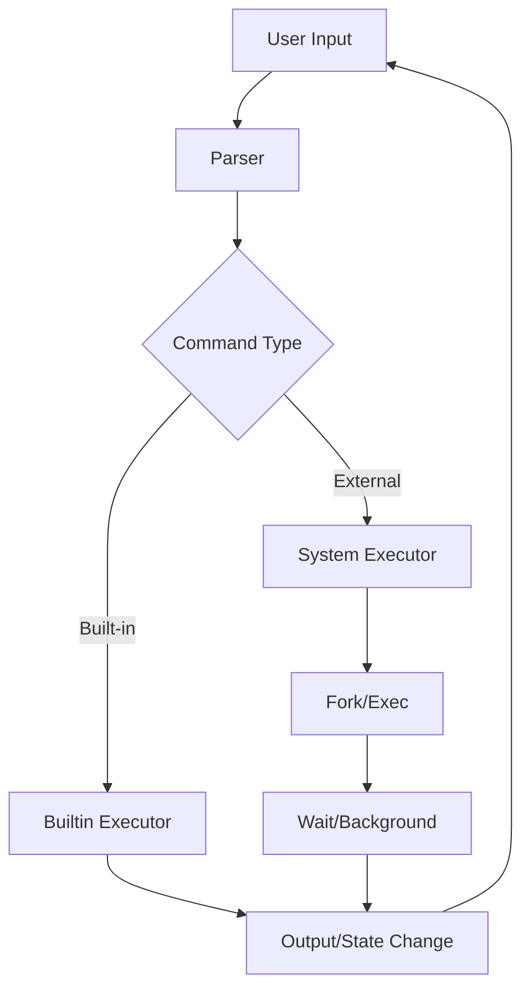

# Shell Design Documentation

## 1. Architecture Overview

ksh (Custom Shell) follows a modular architecture designed around the classic Read-Eval-Print Loop (REPL). The system is divided into distinct components that handle specific responsibilities, promoting separation of concerns and maintainability.

### The REPL Cycle
1.  **Read**: The shell displays a prompt (e.g., `ksh> `) and waits for user input via `stdin`.
2.  **Parse**: The input string is tokenized and structured into a `Command` object.
3.  **Execute**: The shell determines if the command is a builtin or external program and executes it.
4.  **Loop**: The process repeats until an exit signal or command is received.



## 2. Component Design

### 2.1 Parser (`parser.c`)
The parser is responsible for transforming raw text strings into structured data.
- **Tokenization**: Splits strings by whitespace, respecting quotes (`'` and `"`).
- **Expansion**: Handles environment variables (`$VAR`) and home directory (`~`) expansion.
- **Structuring**: Identifies special operators (`|`, `>`, `<`) to build command chains.

### 2.2 Executor (`executor.c`)
The core engine that runs commands.
- **Fork-Exec Model**: Uses `fork()` to create a child process and `execvp()` to replace the child's memory space with the new program.
- **Path Resolution**: Searches directories listed in `$PATH` to find executable files.
- **Process Management**:
    - **Foreground**: Parent calls `waitpid()` to block until execution finishes.
    - **Background**: Parent records the PID and returns immediately to the prompt.

### 2.3 Pipe & Redirection Manager (`pipes.c`, `redirections.c`)
Handles Inter-Process Communication (IPC) and file stream manipulation.
- **Redirection**:
    - Uses `open()` to acquire file descriptors.
    - Uses `dup2()` to swap `STDIN/STDOUT` with file descriptors.
- **Piping**:
    - Creates a pipe object (`int fd[2]`).
    - Connects `STDOUT` of the left command to `STDIN` of the right command.
    - Manages closing of unused pipe ends to prevent deadlocks.

### 2.4 Built-in Command Handler (`builtins.c`)
Executes shell-internal commands that cannot be external programs (because they modify the shell's own memory/state).
- `cd`: Uses `chdir()` to change the current working directory.
- `exit`: Terminates the shell process.
- `export`/`unset`: Modifies the `environ` array.

## 3. Data Structures

The shell relies on a central `Command` structure to pass data between the parser and executor.

```c
typedef struct Command {
    char **args;          // Array of arguments (args[0] is the command)
    int arg_count;        // Number of arguments
    char *input_file;     // Redirect stdin from this file
    char *output_file;    // Redirect stdout to this file
    int append_mode;      // 1 for >>, 0 for >
    int background;       // 1 if command should run in background
    struct Command *next; // Next command in pipe chain
} Command;
```

## 4. Error Handling Strategy

- **System Calls**: Every system call (`fork`, `exec`, `pipe`, `dup2`) is checked for return value `-1` or `NULL`.
- **User Feedback**: Errors are printed to `stderr` using `perror()` or custom messages (e.g., "command not found").
- **Graceful Failure**: A failed command should not crash the shell; the REPL loop must continue.
